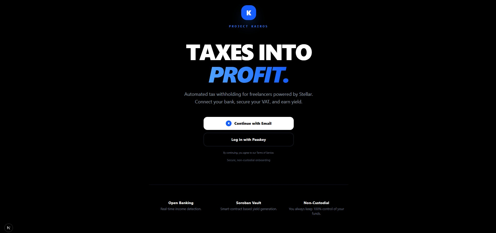
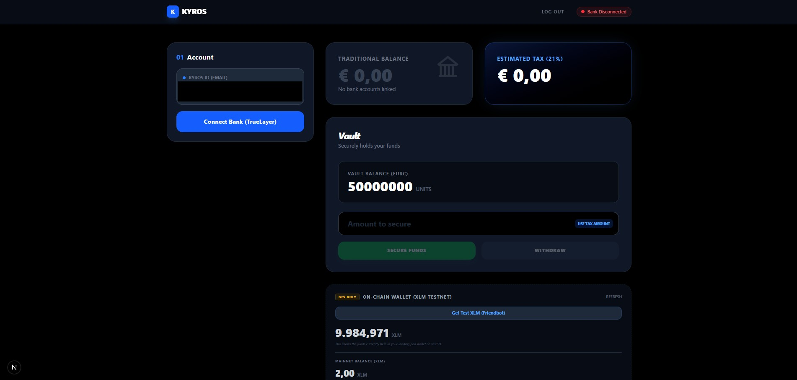

# Kyros (Project Kairos)

Automated tax withholding for freelancers and SMEs, powered by Stellar.
Connect your bank, reserve VAT/income tax in a non-custodial Soroban vault,
and put idle tax balances to work.

This repository is prepared for our application to the Stellar Community Fund
(SCF) Build track.

## Problem
Freelancers and small businesses often under-save for taxes. When they do set
money aside, it sits idle in low-yield accounts, increasing cashflow stress and
late-payment risk.

## Solution
Kyros automates tax withholding using open banking data and a Soroban smart
contract vault:
- Detect incoming revenue via open banking connections.
- Calculate tax/VAT liability in real time.
- Move a portion into a non-custodial Soroban vault.
- Generate yield on reserved balances (MVP uses simulated yield).

## Why Stellar + Soroban
- Low fees and fast settlement for frequent micro-allocations.
- Native support for stablecoins like EURC for tax reserves.
- Soroban smart contracts enable non-custodial vault logic.
- Strong ecosystem support for onboarding, growth, and partnerships.

## Current Status
- MVP web app (Next.js) with onboarding, dashboard, and vault actions.
- Passkey-based auth with seedless, non-custodial Stellar wallet creation.
- Open banking connectors and tax-liability calculations in the API.
- Soroban vault contract + TypeScript client package wired to testnet.
- Testnet contract ID: `CA276HNZKSYAL6X5IH6VSZ4UC6V7AGRG3FAGOD2YDIO2ZVVB5REY4UXK`.

## Seedless Non-Custodial Signup & Login
We use passkeys (WebAuthn) for authentication and PRF-based key derivation.
The server never sees the user’s private key in plaintext.

Signup flow:
1. User enters email; server generates passkey registration options.
2. Client registers a passkey on-device and verifies it with the API.
3. Client performs a passkey authentication with PRF enabled.
4. Client generates a Stellar keypair locally, encrypts the secret with PRF bytes,
   and stores only the encrypted secret + IV on the server.

Login / vault action flow:
1. Client requests passkey authentication options.
2. Client authenticates with passkey + PRF, then verifies with the API.
3. Client fetches the encrypted secret, decrypts it locally using PRF bytes,
   and signs Stellar/Soroban transactions on-device.

## Architecture
- `apps/web`: Next.js app (user onboarding, vault dashboard).
- `apps/api`: API for open banking, tax orchestration, and Stellar helpers.
- `packages/vault`: TypeScript Soroban contract client.
- `soroban-vault`: Soroban smart contract (Rust).

## Getting Started
1. Install dependencies: `pnpm install`
2. Run all apps: `pnpm dev` (or `pnpm dev:web` / `pnpm dev:api`)
3. Configure environment variables: `docs/environment-variables.md`

## Docs
- Environment variables: `docs/environment-variables.md`